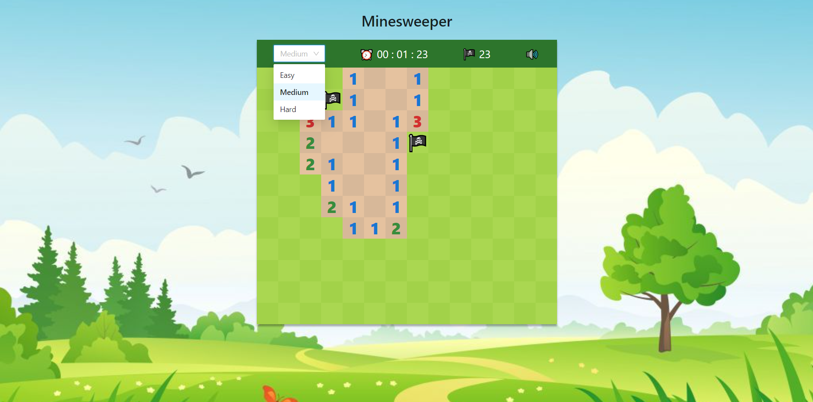
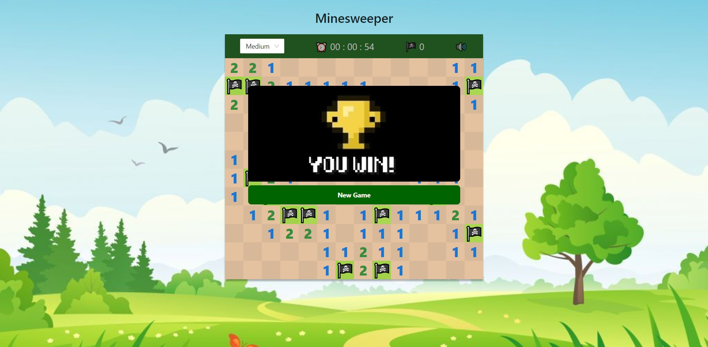

# A Minesweeper game using React Hooks

Use Left Mouse Button to reveal cell or Right Mouse Button to flagge

The game has three levels (Easy, Medium, Hard).
Select level use library Ant-Design

Game Over

Game Win

